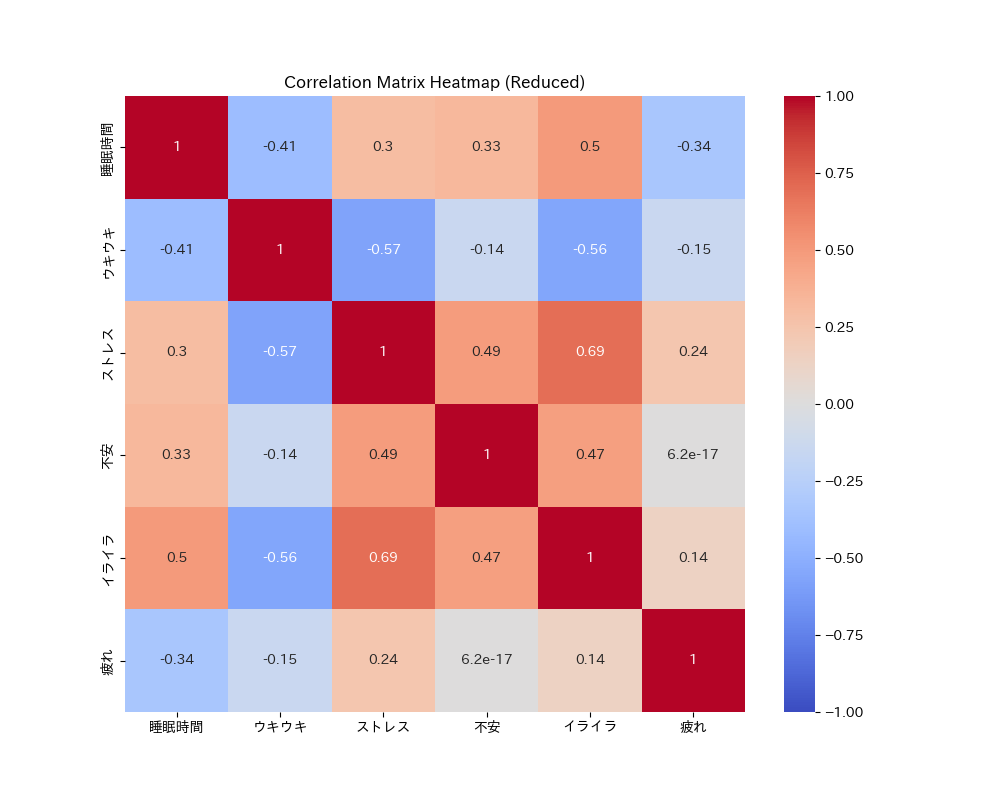

# HealthTracker(仮) Version 1.0

HealthTracker(仮)は、日々の活動報告データを用いて健康状態を分析・予測するプロジェクトです。数値データとテキストデータを組み合わせ、大規模言語モデル（LLM）を活用することで、深い分析と個別化されたセルフケア提案を提供し、全体的な健康状態の向上を目指します。

## 目次
- [イントロダクション](#イントロダクション)
- [特徴](#特徴)
- [Webアプリデモ](#Webアプリデモ)
- [アプリを体験](#アプリを体験)
- [データ分析と予測](#データ分析と予測)
- [貢献](#貢献)
- [ライセンス](#ライセンス)

## イントロダクション
HealthTracker(仮)は、睡眠時間、起床時間、食事時間、ストレスレベルなどの数値データと、日々の感情や出来事を記述したフリースペースのテキストデータを組み合わせて、健康状態を分析・予測します。機械学習モデルとLLMを活用し、健康に影響を与える主要な要因を特定し、より良いセルフケアのためのアクションプランを提供します。

## 特徴
- **データ取り込み**：CSVファイルから数値データとテキストデータを読み込み、前処理を行います。
- **感情分析**：LLMを使用して、フリースペースのテキストエントリの感情を分析します。（今後実装予定）
- **キーワード抽出**：TF-IDFを用いて、フリースペースのエントリから重要なキーワードを抽出します。（今後実装予定）
- **予測モデリング**：機械学習モデルを構築し、健康に関連する指標（例：ストレスレベル、睡眠の質）を予測します。
- **個別化された提案**：モデルの予測結果とテキスト分析に基づいて、個別化されたセルフケア提案を生成します。

## Webアプリデモ

[YouTubeショート動画](https://www.youtube.com/shorts/BfnZfj9AQzs?si=51YhB46zbte-PcgJ)

## アプリを体験
[HealthTracker on StreamlitCloud](https://healthtracker-vsbqjhs8wuuk5ddd9mhehd.streamlit.app/)

## データ分析と予測
HealthTracker(仮)は、以下の主要な健康指標に焦点を当て、様々な分析手法を使用します。

### 主要指標
- **睡眠時間**：睡眠の質と量を分析します。
- **起床時間**：起床時間の規則性と体調との関係を分析します。
- **ストレスレベル**：主観的なストレスレベルを評価します。
- **感情的幸福度**：テキスト分析を通じてポジティブおよびネガティブな感情を評価します。

### 分析手法
- **相関分析**：異なる健康指標間の関係を明らかにします。（実装済み）
- **回帰分析**：各要因が健康指標にどの程度影響を与えるかをモデル化します。（実装済み）
- **クラスタリング分析**：似たようなパターンを持つグループを特定します。（今後実装予定）
- **感情分析**：LLMを使用して、フリースペースのエントリから感情のトーンを抽出します。（今後実装予定）
- **テキスト要約**：長いテキストエントリを要約し、重要なポイントを抽出します。（今後実装予定）

### 予測モデリング
- **機械学習モデル**：ランダムフォレスト、線形回帰、決定木などのモデルを使用して健康指標を予測します。（今後実装予定）
- **異常検知**：テキストデータ内の異常なパターンを検出し、早期介入のためのアラートを出します。（今後実装予定）

### 一例としてのデータ分析結果
今回の分析では、以下の変数に焦点を当てました：
- **睡眠時間**
- **ウキウキ**
- **ストレス**
- **不安**
- **イライラ**
- **疲れ**

#### 相関行列のヒートマップ
相関行列のヒートマップは、各変数間の相関関係を視覚的に示しています。



#### 回帰係数のプロット
回帰係数のプロットは、各独立変数が従属変数（ウキウキ度）に与える影響を示しています。バーの長さは係数の大きさを示し、エラーバーはその不確実性を示します。

[回帰係数のプロット](images/regression_coefficients_reduced.png)

#### 回帰分析の結果
```plaintext
                             OLS Regression Results                            
==============================================================================
Dep. Variable:                   ウキウキ   R-squared (uncentered):              0.932
Model:                            OLS   Adj. R-squared (uncentered):           0.922
Method:                 Least Squares   F-statistic:                          85.77
Date:                Sun, 16 Jun 2024   Prob (F-statistic):                    3.28e-17
Time:                        23:12:37   Log-Likelihood:                         -46.325
No. Observations:                  36   AIC:                                      102.7
Df Residuals:                      31   BIC:                                      110.6
Df Model:                           5                                                  
Covariance Type:            nonrobust                                                  
==============================================================================
                 coef    std err          t      P>|t|      [0.025      0.975]
------------------------------------------------------------------------------
睡眠時間          0.5237      0.062      8.491      0.000       0.398       0.650
ストレス         -0.2784      0.223     -1.249      0.221      -0.733       0.176
不安            0.2398      0.195      1.227      0.229      -0.159       0.638
イライラ         -0.5860      0.231     -2.533      0.017      -1.058      -0.114
疲れ            0.2951      0.118      2.506      0.018       0.055       0.535
==============================================================================
Omnibus:                        1.486   Durbin-Watson:                   1.480
Prob(Omnibus):                  0.476   Jarque-Bera (JB):                1.103
Skew:                          -0.161   Prob(JB):                        0.576
Kurtosis:                       2.206   Cond. No.                         14.2
==============================================================================

Notes:
[1] R² is computed without centering (uncentered) since the model does not contain a constant.
[2] Standard Errors assume that the covariance matrix of the errors is correctly specified.
```

# 解説
## 相関分析の解説
### ウキウキ度と他の変数の相関:**
ウキウキ度と睡眠時間には正の相関があります（0.524）。これは、睡眠時間が増えるとウキウキ度が上がる傾向があることを示しています。
ウキウキ度とストレスには負の相関があります（-0.278）。これは、ストレスが増えるとウキウキ度が下がる傾向があることを示しています。
ウキウキ度とイライラには強い負の相関があります（-0.586）。これは、イライラが増えるとウキウキ度が大きく下がることを示しています。
## 回帰分析の解説
モデルの有効性:

このモデルのR-squaredは0.932であり、これはモデルがデータの変動の93.2%を説明できることを示しています。これは非常に高い値であり、モデルがデータに対して適合していることを示しています。
各変数の影響:

睡眠時間:
睡眠時間の係数は0.524で、これは睡眠時間が1時間増えるとウキウキ度が0.524ポイント上がることを示しています。この結果は統計的に非常に有意(p < 0.001）です。
  - **ストレス**:
    - ストレスの係数は-0.278で、これはストレスが1ポイント増えるとウキウキ度が0.278ポイント下がることを示しています。ただし、この結果は統計的に有意ではありません（p > 0.05）。
  - **不安**:
    - 不安の係数は0.240で、これは不安が1ポイント増えるとウキウキ度が0.240ポイント上がることを示していますが、この結果は統計的に有意ではありません（p > 0.05）。
  - **イライラ**:
    - イライラの係数は-0.586で、これはイライラが1ポイント増えるとウキウキ度が0.586ポイント下がることを示しています。この結果は統計的に有意です（p < 0.05）。
  - **疲れ**:
    - 疲れの係数は0.295で、これは疲れが1ポイント増えるとウキウキ度が0.295ポイント上がることを示しています。この結果は統計的に有意です（p < 0.05）。

### 考察
1. **睡眠時間の重要性**:
   - 睡眠時間がウキウキ度に与える影響は大きく、睡眠時間を十分に確保することが精神的な健康にとって重要であることが示唆されます。

2. **ストレスとイライラの影響**:
   - ストレスとイライラがウキウキ度を低下させることがわかりました。特にイライラは非常に強い負の影響を与えています。このことから、ストレス管理やリラクゼーションの手法を取り入れることが精神的な健康を維持するために重要であることが示唆されます。

3. **不安と疲れの予想外の影響**:
   - 不安がウキウキ度を上げる傾向が見られましたが、これは直感に反する結果です。これはデータの特性や他の要因が影響している可能性があります。
   - 疲れがウキウキ度を上げる結果も予想外であり、これもさらなる調査が必要です。

### 結論
この分析から、睡眠時間を増やし、ストレスやイライラを減らすことがウキウキ度を向上させるために重要であることが示唆されました。今後の研究では、不安や疲れがウキウキ度に与える影響についてさらに詳しく調査する必要があります。

### 具体的なアクションプラン

#### 1. 睡眠時間の確保
- **データ結果**: 睡眠時間が増えるとウキウキ度が上がる（正の相関：0.524）。
- **具体的な提案**:
  - **目標設定**: 毎日7-8時間の睡眠を確保することを目標にする。
  - **実施方法**:
    - 就寝時間と起床時間を固定し、規則正しい睡眠習慣を身につける。
    - 寝る前の1時間はリラックスするための時間とし、スマートフォンやパソコンなどの画面を見ない。
    - 寝室の環境を整える（静かで暗い部屋、快適な温度）。

#### 2. ストレス管理
- **データ結果**: ストレスが増えるとウキウキ度が下がる（負の相関：-0.278）。
- **具体的な提案**:
  - **目標設定**: 毎日のストレスレベルを3以下に保つことを目標にする。
  - **実施方法**:
    - 毎日10分間の瞑想や深呼吸を行う。
    - 週に1回、好きな趣味やリラックスできるアクティビティに時間を使う。
    - ストレスを感じたときには、その原因を書き出し、解決策を考える時間を持つ。

#### 3. イライラの軽減
- **データ結果**: イライラが増えるとウキウキ度が大きく下がる（負の相関：-0.586）。
- **具体的な提案**:
  - **目標設定**: 毎日のイライラ度を2以下に保つことを目標にする。
  - **実施方法**:
    - 怒りを感じたときには、その場で深呼吸をして気持ちを落ち着ける。
    - イライラの原因を日記に書き出し、解決策を見つける習慣をつける。
    - 定期的にマッサージやヨガなど、リラクゼーションのための時間を設ける。

#### 4. 疲れの管理
- **データ結果**: 疲れが増えるとウキウキ度が上がる（正の相関：0.295）。
  - これは一見直感に反する結果ですが、疲労感が活動の達成感や充実感に繋がっている可能性があります。したがって、疲労管理をしつつも、充実感を高める活動を提案します。
- **具体的な提案**:
  - **目標設定**: 健康的な疲れを感じつつも、過度な疲労を避けることを目標にする。
  - **実施方法**:
    - **アクティブな生活**: 軽い運動や趣味の活動を積極的に取り入れ、達成感を感じる。
    - **休息の確保**: 適度な休息を取り、過度な疲労を避ける（1時間ごとに5分間の休憩）。
    - **栄養管理**: バランスの取れた食事を心がけ、特にビタミンやミネラルをしっかり摂る。

### フィードバックと継続的な改善
1. **データモニタリング**:
   - 毎日、自分の睡眠時間、ストレスレベル、イライラ度、疲れ度を記録し、ウキウキ度との関係を確認する。
   - ウキウキ度が下がったときには、その日の他の指標を見直し、原因を特定する。

2. **定期的な見直し**:
   - 1ヶ月ごとにデータを見直し、アクションプランの効果を評価する。
   - 目標が達成できなかった場合には、新たな対策を考え、次の月に実施する。

これらの具体的なアクションプランを実施することで、データに基づいた健康状態の改善が期待できます。継続的なデータのモニタリングとフィードバックを通じて、自身の健康管理をより効果的に行ってください。

## 貢献
貢献は歓迎します！このプロジェクトに貢献する方法については、[CONTRIBUTING.md](CONTRIBUTING.md)ファイルをお読みください。

## ライセンス
このプロジェクトはMITライセンスの下でライセンスされています。詳細については[LICENSE](LICENSE)ファイルをご覧ください。
